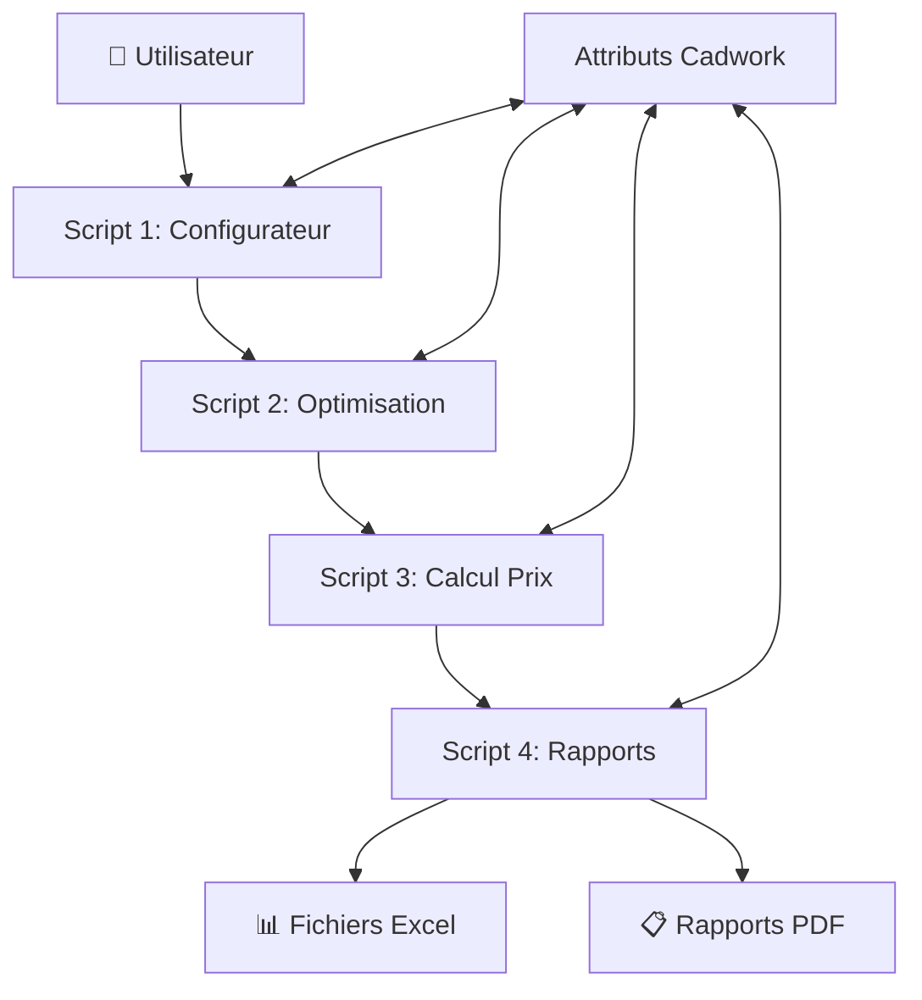

# 🏗️ Projet Cadwork - Système de Devis Modulaire

## 📋 Table des Matières
- [Vue d'ensemble](#vue-densemble)
- [Environnement Cadwork](#environnement-cadwork)
- [Architecture du Système](#architecture-du-système)
- [Workflow Utilisateur](#workflow-utilisateur)
- [Attributs Cadwork](#attributs-cadwork)
- [Spécifications Techniques](#spécifications-techniques)
- [Scripts Détaillés](#scripts-détaillés)
- [API Cadwork](#api-cadwork)
- [Contraintes et Limitations](#contraintes-et-limitations)

---

## 🎯 Vue d'ensemble

### Objectif
Créer un système modulaire de génération de devis pour Cadwork, composé de 4 scripts indépendants et séquentiels, remplaçant les scripts monolithiques actuels.

### Problèmes Résolus
- ✅ **Scripts trop complexes** (1000+ lignes) → Scripts modulaires (200-300 lignes)
- ✅ **Interface surchargée** → Interfaces spécialisées par étape
- ✅ **Maintenance difficile** → Scripts indépendants testables
- ✅ **Gestion d'erreur défaillante** → Localisation précise des problèmes
- ✅ **Performance dégradée** → Optimisations ciblées

### Principes de Conception
- **Modularité** : Un script = une responsabilité
- **Autonomie** : Chaque script peut être lancé indépendamment
- **Persistance** : Toutes les données stockées dans les attributs Cadwork
- **Workflow guidé** : Interface utilisateur progressive et intuitive

---

## 🖥️ Environnement Cadwork

### Configuration Système
```python
# Chemin obligatoire pour accès API Cadwork
import sys
sys.path.append(r"C:\cadwork\libs")

# Imports API Cadwork
import cadwork
import geometry_controller as gc
import attribute_controller as ac
import element_controller as ec
import material_controller as mc
import utility_controller as uc
```

### Spécificités Cadwork
- **Python embarqué** : Version Python intégrée à Cadwork (pas d'installation externe)
- **Une seule fenêtre Tkinter** : Limitation à une interface graphique simultanée
- **API synchrone** : Appels bloquants aux contrôleurs Cadwork
- **Attributs utilisateur** : 30 attributs personnalisables par élément (1-30)
- **Persistence automatique** : Données sauvegardées avec le fichier .3d

### Documentation API
- **Référence complète** : https://docs.cadwork.com/projects/cwapi3dpython/en/latest/
- **Geometry Controller** : https://docs.cadwork.com/projects/cwapi3dpython/en/latest/documentation/geometry_controller/
- **Attribute Controller** : Gestion des attributs utilisateur et matériaux
- **Element Controller** : Sélection et manipulation des éléments
- **Material Controller** : Gestion des matériaux et prix

### Contraintes Techniques
- **Pas de librairies externes** non validées par Cadwork
- **Pas d'accès réseau** direct depuis les scripts
- **Gestion mémoire** : Éviter les fuites avec de gros volumes
- **Thread safety** : API Cadwork non thread-safe

---

## 🏗️ Architecture du Système

### Vue d'ensemble


### Flux de Données
```
Éléments Sélectionnés → Config → Attributs CW → Optimisation → Attributs CW → Prix → Attributs CW → Rapports
```

### Communication Inter-Scripts
- **Méthode** : Attributs utilisateur Cadwork (persistence automatique)
- **Lancement** : `subprocess.Popen()` après fermeture interface précédente
- **Contrôle** : Boutons "Étape Suivante" dans chaque interface

---

## 👥 Workflow Utilisateur

### Étape 1 : Configuration (Script 1)
```
1. Utilisateur sélectionne éléments dans Cadwork
2. Lance "configurateur_devis.py"
3. Interface affiche tous les matériaux détectés
4. Configuration par matériau :
   ├── Unité (m³/m²/ml)
   ├── Méthode calcul Cadwork
   ├── Optimisation (oui/non)
   ├── Type optimisation (fixe/variable)
   ├── Prix matière (activé/désactivé)
   ├── Façonnage (activé/désactivé)
   └── Traitement (activé/désactivé)
5. Validation et sauvegarde automatique
6. Bouton [OPTIMISER] → Ferme interface → Lance Script 2
```

### Étape 2 : Optimisation (Script 2)
```
1. "optimisation_scierie.py" s'ouvre automatiquement
2. Lit configuration depuis attributs Cadwork
3. Interface simple avec progress bar
4. Optimisation automatique des matériaux configurés
5. Écriture résultats (N° barre, taux chute) dans attributs
6. Bouton [CALCULER PRIX] → Lance Script 3
```

### Étape 3 : Calcul Prix (Script 3)
```
1. "calcul_prix.py" s'ouvre automatiquement
2. Lit config + résultats optimisation
3. Calcul prix matière, façonnage, traitement, prestations
4. Écriture tous prix dans attributs Cadwork
5. Bouton [GÉNÉRER RAPPORTS] → Lance Script 4
```

### Étape 4 : Rapports (Script 4)
```
1. "generation_rapports.py" s'ouvre automatiquement
2. Lit toutes données depuis attributs
3. Génération fichiers Excel par groupe/sous-groupe
4. Ouverture automatique des fichiers
5. Bouton [TERMINER] → Fin du processus
```

---

## 🏷️ Attributs Cadwork

### Attribution des Attributs Utilisateur

#### Attributs Existants (À Conserver)
| Attribut | Usage | Valeurs | Statut |
|----------|-------|---------|--------|
| **1** | Traitement | Code traitement | ✅ Existant |
| **2** | Prestation MO | Code prestation | ✅ Existant |
| **3** | Ouvrage (Groupe principal) | Nom groupe | ✅ Existant |
| **7** | Tarif traitement | Prix traitement | ✅ Existant |
| **8** | Tarif matière | Prix matière pièce | ✅ Existant |
| **9** | Tarif façonnage | Prix façonnage | ✅ Existant |
| **10** | Tarif presta sup | Prix prestations | ✅ Existant |
| **11** | Prix total | Prix total pièce | ✅ Existant |
| **12** | Numéro barre opti | N° barre optimisation | ✅ Existant |
| **13** | Taux de chute | Taux chute % | ✅ Existant |
| **15** | Tarif matière optimisée | Prix achat avec chutes | ✅ Existant |
| **16** | Sous ouvrage | Sous-groupe | ✅ Existant |
| **20** | AS400 | Code AS400 | ✅ Existant |

#### Configuration Nouvelle (Script 1 → Scripts 2-4)
| Attribut | Usage | Valeurs | Défaut | Exemple |
|----------|-------|---------|--------|---------|
| **4** | Unité matériau | `m3`/`m2`/`ml` | Auto-détecté | `m3` |
| **5** | À optimiser | `1`/`0` | `1` | `1` |
| **6** | Type optimisation | `fixe`/`variable` | `variable` | `variable` |
| **14** | Méthode calcul Cadwork | `manuel`/`volume_standard`/etc | `manuel` | `volume_standard` |
| **17** | Taux chute manuel | `float` (0-20%) | `0.0` | `5.0` |
| **18** | Coût traitement chutes | `float` par unité | `0.0` | `80.0` |
| **19** | Prix matière forcé | `float` €/unité | Prix matériau CW | `125.50` |

#### Résultats Optimisation (Script 2 → Scripts 3-4)
| Attribut | Usage | Valeurs | Exemple |
|----------|-------|---------|---------|
| **12** | N° barre optimisation | `string` | `BARRE_001` |
| **13** | Taux chute % | `float%` | `12.5%` |

#### Résultats Prix (Script 3 → Script 4)
| Attribut | Usage | Calcul | Exemple |
|----------|-------|--------|---------|
| **8** | Prix matière pièce (SANS chute) | `quantité_base * prix_unitaire` | `45.50` |
| **15** | Prix achat matière (AVEC chutes) | `prix_piece * (1 + taux_chute)` | `52.30` |
| **9** | Prix façonnage | Selon SKU si présent | `12.80` |
| **7** | Prix traitement | Selon attribut 1 si rempli | `8.90` |
| **10** | Prix prestations | Selon attribut 2 si rempli | `15.60` |
| **11** | **Prix total pièce** | **`attr15 + attr9 + attr7 + attr10`** | **`134.10`** |

#### Logique Prix Matière Détaillée
```python
# 1. Prix de base (sans chute)
prix_piece_base = quantite_base * prix_unitaire_attr19
ac.set_user_attribute([eid], 8, str(prix_piece_base))

# 2. Prix d'achat réel (avec chute)  
taux_chute = get_taux_chute(eid)  # Optimisé OU manuel (attr 17)
prix_achat_reel = prix_piece_base * (1 + taux_chute/100)
ac.set_user_attribute([eid], 15, str(prix_achat_reel))

# 3. Prix total = Prix achat + autres coûts
prix_total = prix_achat_reel + prix_faconnage + prix_traitement + prix_prestations
ac.set_user_attribute([eid], 11, str(prix_total))
```

#### Groupement (Existants - utilisés par Script 4)
| Attribut | Usage | Valeurs | Exemple |
|----------|-------|---------|---------|
| **3** | Groupe principal | `string` | `MURS_RDC` |
| **16** | Sous-groupe | `string` | `MUR_NORD` |

---

## 📋 Spécifications Techniques

### Technologies Utilisées
- **Python** : Version embarquée Cadwork
- **Tkinter** : Interface graphique (une à la fois)
- **OpenPyXL** : Génération fichiers Excel
- **Subprocess** : Communication entre scripts
- **JSON** : Configuration externe (optionnel)

### Structure des Fichiers
```
cadwork_scripts/
├── 1_configurateur_devis.py        # Interface configuration
├── 2_optimisation_scierie.py       # Optimisation pure
├── 3_calcul_prix.py                # Calcul prix complet
├── 4_generation_rapports.py        # Rapports Excel
├── config/
│   ├── prix_materiaux.json         # Prix par défaut
│   ├── codes_faconnage.json        # Codes façonnage
│   └── parametres_opti.json        # Paramètres optimisation
├── utils/
│   ├── cadwork_helpers.py          # Fonctions utilitaires
│   ├── calculs_communs.py          # Calculs réutilisables
│   └── validation.py               # Validation données
└── tests/
    ├── test_configurateur.py       # Tests Script 1
    ├── test_optimisation.py        # Tests Script 2
    ├── test_prix.py                # Tests Script 3
    └── test_rapports.py            # Tests Script 4
```

### Performance Cible
- **< 500 éléments** : < 30 secondes total
- **500-2000 éléments** : < 2 minutes total
- **> 2000 éléments** : < 5 minutes total
- **Mémoire** : < 500MB pic utilisation

---

## 📝 Scripts Détaillés

### Script 1 : Configurateur de Devis
**Fichier** : `1_configurateur_devis.py`

#### Responsabilités
- ✅ Interface configuration complète
- ✅ Détection automatique des matériaux
- ✅ Configuration par matériau (unité, méthodes, optimisation)
- ✅ Validation des paramètres
- ✅ Sauvegarde dans attributs Cadwork
- ✅ Lancement Script 2

#### Interface Principale
```
┌────────────────────────────────────────────────────────────┐
│  ⚙️ CONFIGURATEUR DE DEVIS                                  │
├────────────────────────────────────────────────────────────┤
│  📊 Projet: [Nom] | Éléments: [240] | Matériaux: [8]      │
├────────────────────────────────────────────────────────────┤
│ Matériau        │Qté│Opti│Mat│Chut│Unit│Faç│Trai│Prest│    │
├─────────────────┼───┼───┼───┼────┼────┼───┼────┼─────┤    │
│ Epicea_Sapin    │150│ ☑ │ ☑ │ ☑  │ m³ │ ☑ │ ☑  │  ☑  │    │
│ OSB_12mm        │ 25│ ☐ │ ☑ │ ☐  │ m² │ ☑ │ ☐  │  ☑  │    │
│ Barre_Acier_L   │ 10│ ☑ │ ☑ │ ☐  │ ml │ ☑ │ ☑  │  ☑  │    │
├─────────────────┴───┴───┴───┴────┴────┴───┴────┴─────┤    │
│ Configuration rapide: [Bois] [Panneaux] [Linéaires]   │    │
├────────────────────────────────────────────────────────────┤
│                        [OPTIMISER] ────────────────────────┼─►│
└────────────────────────────────────────────────────────────┘
```

#### Fonctions Clés
```python
def detect_materials()              # Analyse éléments + récupère prix Cadwork
def create_config_interface()       # Gros tableau déroulant avec scroll
def load_material_prices()          # Charge prix depuis matériaux Cadwork → attr 19
def modify_material_price()         # Popup modification prix matière
def validate_configuration()        # Validation paramètres + prix
def save_to_cadwork_attributes()    # Sauvegarde attributs 4-6, 14, 17-19
def launch_optimization()           # Ferme UI + lance Script 2

# Nouvelles fonctions prix matière
def get_cadwork_material_price(material_name)  # Prix depuis mc.get_price()
def set_forced_material_price(material, price) # Force prix dans attribut 19
def reset_material_price_to_default()          # Remet prix Cadwork par défaut
```

#### Logique Prix Matière
1. **Chargement initial** : `prix_cadwork = mc.get_price(material_id)`
2. **Sauvegarde attribut** : `ac.set_user_attribute(eids, 19, str(prix_cadwork))`
3. **Modification possible** : Utilisateur peut changer dans le tableau
4. **Scripts suivants** : Lisent **TOUJOURS** l'attribut 19, jamais le matériau Cadwork
5. **Flexibilité totale** : Prix spéciaux par projet, remises, tarifs négociés

#### Valeurs par Défaut
- **Taux chute manuel** : 0% (plage 0-20%)
- **Coût traitement chutes** : 0€ par unité
- **Prix matière** : Récupéré automatiquement depuis matériau Cadwork

#### Logique Métier Simplifiée
- **Prix matière** : Toujours calculé (prix=0 si matériau non défini)
- **Façonnage** : Calculé automatiquement si `ac.get_sku(eid)` retourne une valeur
- **Traitement** : Calculé automatiquement si `ac.get_user_attribute(eid, 1)` rempli
- **Prestations** : Calculé automatiquement si `ac.get_user_attribute(eid, 2)` rempli
- **Chutes** : 
  - Si optimisation → Calculé par algorithme
  - Si pas optimisation → Taux manuel (attribut 17)

### Script 2 : Optimisation Scierie
**Fichier** : `2_optimisation_scierie.py`

#### Responsabilités
- ✅ Lecture configuration depuis attributs Cadwork (4-6, 14, 17-18)
- ✅ Filtrage éléments à optimiser (attribut 5 = "1")
- ✅ **Conservation logique métier existante** : Algorithmes optimisation éprouvés
- ✅ Application taux chute manuel si pas d'optimisation (attribut 17)
- ✅ Calcul taux de chute optimisé
- ✅ Attribution numéros de barres
- ✅ Sauvegarde résultats (attributs 12-13)
- ✅ Lancement Script 3

#### Logique Métier Conservée
- **Algorithmes d'optimisation** : First Fit Decreasing existant
- **Calcul des barres** : Logique de découpe et marge existante  
- **Gestion sections** : Groupement par largeur/hauteur
- **Valorisation chutes** : Selon coût attribut 18
- **Priorités longueurs** : Fixe ou variable selon config

#### Interface Optimisation
```
┌────────────────────────────────────────────────────────────┐
│  🔧 OPTIMISATION SCIERIE                                   │
├────────────────────────────────────────────────────────────┤
│  Matériau actuel: Epicea_Sapin KVH                        │
│  Section: 60x180mm                                        │
│  Progress: ███████████░░░ 85% (128/150)                   │
├────────────────────────────────────────────────────────────┤
│  📊 Statistiques temps réel:                              │
│  • Barres créées: 23                                      │
│  • Taux chute moyen: 12.3%                               │
│  • Longueur moyenne: 9.8m                                │
│  • Optimisation: First Fit Decreasing                    │
├────────────────────────────────────────────────────────────┤
│                    [CALCULER PRIX] ────────────────────────┼─►│
└────────────────────────────────────────────────────────────┘
```

#### Algorithmes Disponibles
- **First Fit Decreasing** : Algorithme de base, rapide
- **Best Fit Decreasing** : Minimise les chutes
- **Génétique** : Optimisation avancée pour gros volumes

### Script 3 : Calcul Prix
**Fichier** : `3_calcul_prix.py`

#### Responsabilités
- ✅ Lecture config + résultats optimisation (attributs 4-6, 12-13, 17-19)
- ✅ **Calcul prix matière base** (volume × prix unitaire attr 19 → attr 8)
- ✅ **Calcul prix achat réel** (prix base × (1+taux_chute) → attr 15)
- ✅ Calcul prix façonnage (automatique si SKU présent → attr 9)
- ✅ Calcul prix traitement (automatique si attribut 1 rempli → attr 7)
- ✅ Calcul prix prestations (automatique si attribut 2 rempli → attr 10)
- ✅ **Calcul prix total** (prix achat + façonnage + traitement + prestations → attr 11)
- ✅ Valorisation des chutes (selon coût attribut 18)
- ✅ Application taux chute (optimisé attr 13 prioritaire, sinon manuel attr 17)
- ✅ Lancement Script 4

#### Interface Calcul Prix Détaillée
```
┌────────────────────────────────────────────────────────────┐
│  💰 CALCUL DES PRIX                                        │
├────────────────────────────────────────────────────────────┤
│  Progress global: ████████████ 100% (240/240)             │
├────────────────────────────────────────────────────────────┤
│  💶 Détail calcul matière:                                │
│  • Prix base (sans chute): 13,250.00 € (attr 8)          │
│  • Prix achat (avec chute): 15,450.50 € (attr 15)        │
│  • Surcoût chutes: +2,200.50 € (+16.6%)                  │
├────────────────────────────────────────────────────────────┤
│  💶 Autres coûts:                                         │
│  • Prix façonnage: 3,280.75 € (codes SKU auto)           │
│  • Prix traitement: 1,125.30 € (attr 1 auto)             │
│  • Prix prestations: 2,890.45 € (attr 2 auto)            │
│  • Valorisation chutes: -680.25 € (config attr 18)       │
│  ═══════════════════════════════════════════════════════  │
│  • TOTAL PROJET: 22,066.75 €                             │
│    (= 15,450.50 + 3,280.75 + 1,125.30 + 2,890.45 - 680.25) │
├────────────────────────────────────────────────────────────┤
│  💡 Prix total = Prix achat matière (AVEC chutes) + autres │
├────────────────────────────────────────────────────────────┤
│                 [GÉNÉRER RAPPORTS] ────────────────────────┼─►│
└────────────────────────────────────────────────────────────┘
```

#### Méthodes de Calcul
```python
def calculate_base_material_price(eid):
    """Prix matière de base (SANS chute) → Attribut 8"""
    prix_unitaire = float(ac.get_user_attribute(eid, 19))  # Prix forcé config
    unite = ac.get_user_attribute(eid, 4)  # m3/m2/ml
    quantite_base = get_quantity_by_unit(eid, unite)
    return quantite_base * prix_unitaire

def calculate_real_purchase_price(eid):
    """Prix d'achat réel (AVEC chutes) → Attribut 15"""
    prix_base = float(ac.get_user_attribute(eid, 8))
    taux_chute = get_waste_rate(eid)  # Optimisé OU manuel (attr 17)
    return prix_base * (1 + taux_chute/100)

def calculate_total_piece_price(eid):
    """Prix total pièce → Attribut 11"""
    prix_achat = float(ac.get_user_attribute(eid, 15))      # AVEC chutes
    prix_faconnage = float(ac.get_user_attribute(eid, 9))   # Si SKU présent
    prix_traitement = float(ac.get_user_attribute(eid, 7))  # Si attr 1 rempli
    prix_prestations = float(ac.get_user_attribute(eid, 10)) # Si attr 2 rempli
    return prix_achat + prix_faconnage + prix_traitement + prix_prestations

def get_waste_rate(eid):
    """Récupère taux de chute : optimisé OU manuel"""
    # Si optimisé (attr 13 rempli par Script 2)
    taux_opti = ac.get_user_attribute(eid, 13)
    if taux_opti and taux_opti.strip():
        return float(taux_opti.replace('%', ''))
    
    # Sinon taux manuel (attr 17 configuré)
    taux_manuel = ac.get_user_attribute(eid, 17)
    return float(taux_manuel or 0.0)
```

#### Logique de Calcul Complète
- **Prix matière de base (attr 8)** : Volume réel × Prix unitaire configuré (attr 19)
- **Prix achat avec chutes (attr 15)** : Prix base × (1 + taux_chute%)
- **Prix total final (attr 11)** : Prix achat (15) + Façonnage (9) + Traitement (7) + Prestations (10)
- **Taux chute intelligent** : Optimisé (attr 13) si disponible, sinon manuel (attr 17)
- **Cohérence ancienne logique** : Prix total inclut bien le surcoût des chutes

### Script 4 : Génération Rapports
**Fichier** : `4_generation_rapports.py`

#### Responsabilités
- ✅ Lecture toutes données depuis attributs
- ✅ Groupement par groupe/sous-groupe (attributs 3, 16)
- ✅ Génération Excel détaillé par pièce
- ✅ Génération Excel synthèse par groupe
- ✅ Génération commandes fournisseur
- ✅ Génération rapport hiérarchique
- ✅ Ouverture automatique fichiers

#### Interface Rapports
```
┌────────────────────────────────────────────────────────────┐
│  📊 GÉNÉRATION RAPPORTS                                    │
├────────────────────────────────────────────────────────────┤
│  ✅ Excel détaillé par pièce                              │
│  ✅ Excel synthèse par groupe                             │  
│  ✅ Commandes fournisseur                                 │
│  ✅ Rapport hiérarchique                                  │
├────────────────────────────────────────────────────────────┤
│  📁 Fichiers générés:                                     │
│  • DEVIS-2024-projet-detail.xlsx                          │
│  • DEVIS-2024-projet-synthese.xlsx                        │
│  • DEVIS-2024-projet-commandes.xlsx                       │
│  • DEVIS-2024-projet-hierarchique.xlsx                    │
├────────────────────────────────────────────────────────────┤
│                      [TERMINER]                           │
└────────────────────────────────────────────────────────────┘
```

#### Formats de Sortie
- **Excel Détaillé** : Une ligne par pièce avec tous les prix
- **Excel Synthèse** : Groupement par matériau et groupe
- **Excel Hiérarchique** : Présentation devis client
- **Excel Commandes** : Optimisé pour commandes fournisseur

---

## 🔌 API Cadwork

### Contrôleurs Principaux

#### Geometry Controller
```python
import geometry_controller as gc

# Dimensions éléments
gc.get_length(element_id)              # Longueur physique
gc.get_list_length(element_id)         # Longueur de liste
gc.get_list_width(element_id)          # Largeur de liste  
gc.get_list_height(element_id)         # Hauteur de liste

# Surfaces et volumes
gc.get_volume(element_id)              # Volume standard
gc.get_list_volume(element_id)         # Volume de liste
gc.get_area_of_front_face(element_id)  # Surface face avant
gc.get_element_reference_face_area(element_id) # Surface référence
```

#### Attribute Controller
```python
import attribute_controller as ac

# Attributs utilisateur (1-30)
ac.get_user_attribute(element_id, attribute_number)
ac.set_user_attribute(element_ids_list, attribute_number, value)

# Attributs matériau et codes
ac.get_element_material_name(element_id)  # Nom matériau
ac.get_sku(element_id)                     # SKU façonnage
```

#### Element Controller
```python
import element_controller as ec

# Sélection éléments
ec.get_active_identifiable_element_ids()  # Éléments sélectionnés
ec.get_all_identifiable_element_ids()     # Tous éléments
```

#### Material Controller
```python
import material_controller as mc

# Matériaux et prix
mc.get_material_id(material_name)    # ID matériau par nom
mc.get_price(material_id)            # Prix unitaire matériau
mc.get_unit(material_id)             # Unité matériau
```

#### Utility Controller
```python
import utility_controller as uc

# Informations projet
uc.get_project_number()              # Numéro projet
uc.get_project_user_attribute(1)     # Attribut projet utilisateur 1
```

### Nouvelles Fonctionnalités Spécifiques

#### Prix Matière Forcé/Configurable
**Innovation** : Prix matière stocké dans attribut, pas dans matériau Cadwork
- **Attribut** : 19 (float, prix €/unité)
- **Chargement** : Auto depuis `mc.get_price(material_id)` au démarrage
- **Modification** : Possible dans configurateur (bouton [Modifier])
- **Usage suivant** : Scripts 2-4 lisent **UNIQUEMENT** attribut 19
- **Avantages** :
  - ✅ Prix spéciaux par projet
  - ✅ Remises négociées
  - ✅ Tarifs fournisseur alternatifs
  - ✅ Prix forfaitaires
  - ✅ Indépendance des matériaux Cadwork

#### Taux de Chute Manuel
**Usage** : Quand optimisation désactivée
- **Attribut** : 17 (float, 0-20%)
- **Défaut** : 0%
- **Application** : Multiplié sur quantité matière pour calcul prix achat
- **Interface** : Spinbox dans tableau principal

#### Coût Traitement Chutes  
**Usage** : Valorisation économique des chutes
- **Attribut** : 18 (float, prix par unité matériau)
- **Défaut** : 0€
- **Unités** : €/m³, €/m², €/ml selon unité matériau (attribut 4)
- **Calcul** : `quantité_chute * coût_unité` 
- **Interface** : Champ saisie dans tableau principal

#### Workflow Prix Matière
```
1. Script 1 démarre
   ↓
2. Détecte matériaux → récupère prix Cadwork
   ↓  
3. Sauvegarde prix dans attribut 19
   ↓
4. Utilisateur peut modifier dans tableau
   ↓
5. Scripts 2-4 utilisent UNIQUEMENT attribut 19
   ↓
6. Flexibilité totale des prix par projet
```

### Logique Calcul Prix Détaillée

#### Séquence de Calcul Prix Matière
```
1. Prix unitaire (attr 19) × Quantité base = Prix base (attr 8)
                    ↓
2. Prix base × (1 + taux_chute%) = Prix achat réel (attr 15)
                    ↓  
3. Prix achat + Façonnage + Traitement + Prestations = Prix total (attr 11)
```

#### Exemples Concrets
**Poutre Epicea 60x180x4500mm :**
- Prix unitaire configuré : 125.50 €/m³ (attr 19)
- Volume de base : 0.0486 m³
- **Prix base (attr 8)** : 0.0486 × 125.50 = `6.10 €`
- Taux chute optimisation : 12.5%
- **Prix achat (attr 15)** : 6.10 × 1.125 = `6.86 €`
- Façonnage T1_V : 15.20 €
- **Prix total (attr 11)** : 6.86 + 15.20 = `22.06 €`

#### Cohérence avec Ancienne Logique
- ✅ **Prix total inclut surcoût chutes** (comme script existant)
- ✅ **Prix base conservé** pour traçabilité
- ✅ **Prix achat distinct** pour achat réel matière
- ✅ **Taux chute priorité optimisation** puis manuel
- ✅ **Logique additive** : Total = Achat + Façonnage + Traitement + Prestations

---

## ⚠️ Contraintes et Limitations

### Contraintes Cadwork
- **Une seule interface Tkinter** simultanée
- **API synchrone** : Pas de threading sur appels Cadwork
- **30 attributs utilisateur** maximum par élément
- **Python embarqué** : Version spécifique non modifiable
- **Pas d'accès réseau** direct depuis scripts

### Limitations Techniques
- **Mémoire** : Éviter chargement complet gros projets (>5000 éléments)
- **Performance** : API Cadwork peut être lente sur gros volumes
- **Persistence** : Données perdues si fichier .3d non sauvegardé
- **Compatibilité** : Dépendant version Cadwork

### Bonnes Pratiques
- **Sauvegarde fréquente** : Sauvegarder .3d avant gros traitements
- **Validation entrées** : Vérifier données utilisateur
- **Feedback utilisateur** : Progress bars et messages statut
- **Gestion d'erreurs** : Messages clairs pour utilisateur
- **Tests sur petits volumes** avant production

### Sécurité
- **Backup automatique** : Sauvegarder attributs avant modification
- **Validation prix** : Détecter valeurs aberrantes
- **Logs d'audit** : Tracer modifications importantes
- **Rollback** : Possibilité annuler modifications

---

## 🚀 Étapes de Développement

### Phase 1 : Foundation (Semaine 1-2)
- [ ] Structure projet et fichiers
- [ ] Utilitaires communs (cadwork_helpers.py)
- [ ] Tests de base API Cadwork
- [ ] Script 1 : Interface configurateur basique

### Phase 2 : Core Features (Semaine 3-4)
- [ ] Script 1 : Configuration complète
- [ ] Script 2 : Optimisation basique (First Fit)
- [ ] Script 3 : Calcul prix matière
- [ ] Communication inter-scripts

### Phase 3 : Advanced Features (Semaine 5-6)
- [ ] Script 2 : Algorithmes optimisation avancés
- [ ] Script 3 : Prix façonnage/traitement/prestations
- [ ] Script 4 : Génération rapports Excel
- [ ] Tests intégration complète

### Phase 4 : Polish & Deploy (Semaine 7-8)
- [ ] Interface utilisateur finalisée
- [ ] Gestion d'erreurs robuste
- [ ] Documentation utilisateur
- [ ] Tests de charge et déploiement

---

## 📚 Ressources

### Documentation
- **API Cadwork** : https://docs.cadwork.com/projects/cwapi3dpython/en/latest/
- **Geometry Controller** : https://docs.cadwork.com/projects/cwapi3dpython/en/latest/documentation/geometry_controller/
- **Python Tkinter** : Interface graphique
- **OpenPyXL** : Manipulation fichiers Excel

### Standards de Code
- **PEP 8** : Style Python
- **Type Hints** : Annotations de type
- **Docstrings** : Documentation fonctions
- **Tests unitaires** : Coverage > 80%

---

*Document créé le : [Date actuelle]*  
*Version : 1.0*  
*Auteur : [Nom]*  
*Status : Spécification technique complète*